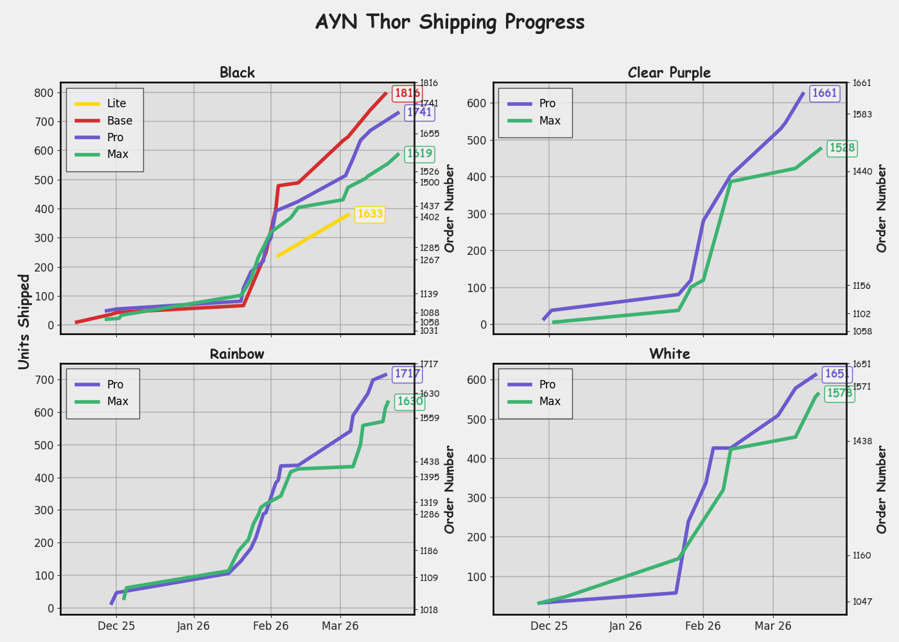

# ayn-thor-tracking

This project tracks and visualizes AYN Thor shipment data.

## Generating the Shipping Progress Graph

To generate and view the shipping progress graph, run:

```
python analysis.py
```

This will create a file called `shipping_progress.png` in the project directory and display the graph.



- The left y-axis shows total units shipped.
- The right y-axis shows order numbers at selected points.
- The latest order number for each model is annotated at the end of each line.
- Model colors:
    - Lite: Yellow
    - Base: Red
    - Pro: Purple
    - Max: Green

---

For more details, see the code in `analysis.py`.
