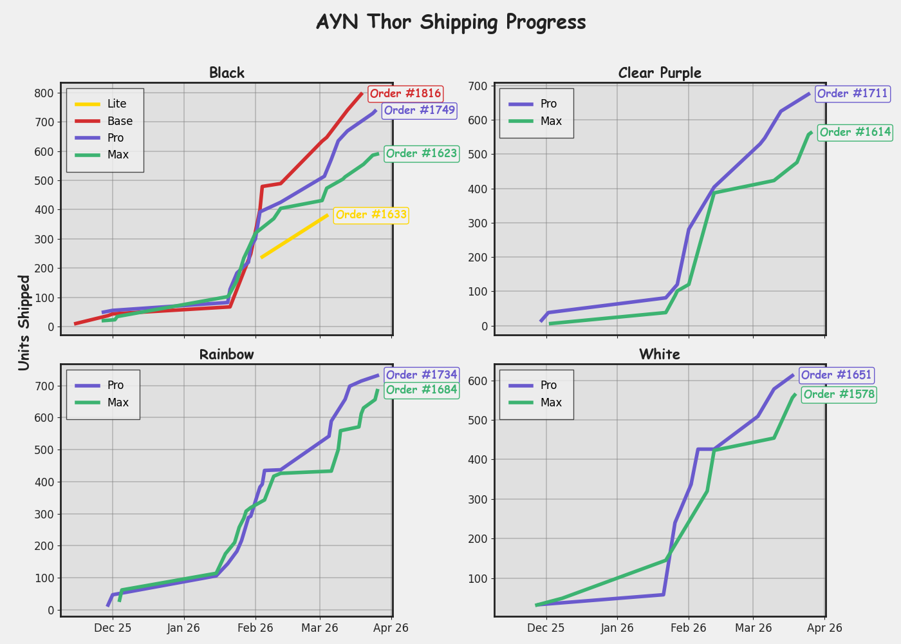
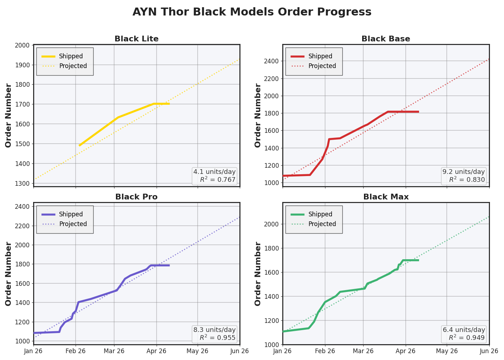
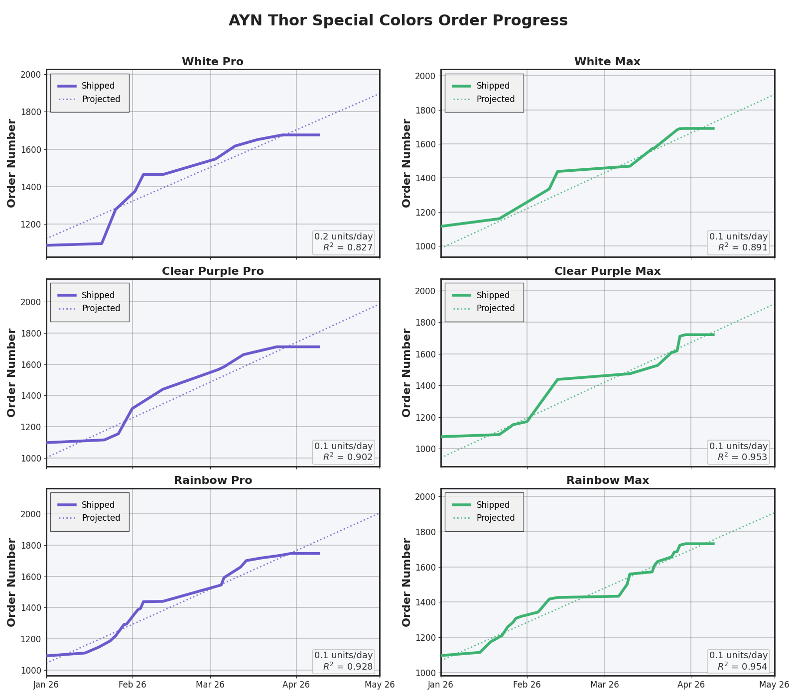

## Get a Shipping Prediction
http://ayn-thor-tracker.com/

## Local Testing

Run both backend and frontend locally with one command:

```bash
cd ayn-thor-shipping
source .venv/bin/activate
python run_local.py
```

Default URLs:

- Frontend: `http://127.0.0.1:8000`
- Backend: `http://127.0.0.1:8001`

Optional flags:

```bash
python run_local.py --host 127.0.0.1 --frontend-port 8000 --backend-port 8001
python run_local.py --no-reload
```


## Current Shipping Progress




---

## API Endpoints

The following endpoints are available in the Shipping Prediction API:

### Root

- **GET /**  
  Returns API status and model info.

  **Example:**
  ```
  GET / 
  ```

  **Response:**
  ```json
  {
    "status": "running",
    "model_version": "v1",
    "trained_at": "2024-06-10T12:00:00Z",
    "available_models": 42
  }
  ```

---

### Health Check

- **GET /health**  
  Returns health status.

  **Example:**
  ```
  GET /health
  ```

  **Response:**
  ```json
  {
    "status": "ok",
    "model_loaded": true
  }
  ```

---

### Predict Shipping Date

- **GET /{color}/{model}/{shipment_number}**  
  Predicts the shipping date for a given color, model, and shipment number.

  **Example:**
  ```
  GET /ClearPurple/Max/1910
  ```

  **Response:**
  ```json
  {
    "make": "Thor",
    "model": "Max",
    "color": "ClearPurple",
    "shipment_number": 1910,
    "predicted_ship_date": "2026-04-29",
    "in_training_range": false,
    "training_order_range": [1000, 1500],
    "model_type": "linear_regression",
    "model_version": "v1",
    "trained_at": "2024-06-10T12:00:00Z"
  }
  ```

---

### List Available Models

- **GET /models**  
  Lists all available (make, model, color) combinations and their order ranges.

  **Example:**
  ```
  GET /models
  ```

  **Response:**
  ```json
  {
    "count": 2,
    "models": [
      {
        "make": "Thor",
        "model": "Max",
        "color": "ClearPurple",
        "rows": 500,
        "order_range": [1000, 1500]
      },
      {
        "make": "Thor",
        "model": "Pro",
        "color": "Black",
        "rows": 300,
        "order_range": [2000, 2300]
      }
    ]
  }
  ```

---

### List Latest Shipments

- **GET /latest**  
  Returns the latest shipping info for each color, with models listed in the order: Lite, Base, Pro, Max.

  **Example:**
  ```
  GET /latest
  ```

  **Response:**
  ```json
  {
    "count": 4,
    "latest_shipments": [
      {
        "color": "ClearPurple",
        "models": [
          {
            "make": "Thor",
            "model": "Lite",
            "latest_order": 1200,
            "latest_ship_date": "2026-04-10",
            "rows": 200
          },
          {
            "make": "Thor",
            "model": "Pro",
            "latest_order": 1500,
            "latest_ship_date": "2026-04-29",
            "rows": 500
          }
        ]
      },
      {
        "color": "Black",
        "models": [
          {
            "make": "Thor",
            "model": "Base",
            "latest_order": 2100,
            "latest_ship_date": "2026-05-05",
            "rows": 250
          },
          {
            "make": "Thor",
            "model": "Max",
            "latest_order": 2300,
            "latest_ship_date": "2026-05-10",
            "rows": 300
          }
        ]
      }
    ]
  }
  ```

---

## Disclaimer

This tracker is a best-effort estimate based on shipping data reported by AYN and observed trends. It's meant to give a general idea of progress — not a static prediction.

Shipping timelines can change for many reasons outside of this tracker’s control, such as production delays, RAM or component shortages, shipping/logistics issues, or changes in AYN’s fulfillment priorities.

Because of this, actual shipping may move faster or slower than shown here. While the data comes from AYN, future shipping progress is still an estimate and things can shift quickly.

This project is not affiliated with AYN — just a community tool built to help everyone get a rough sense of where things stand.
